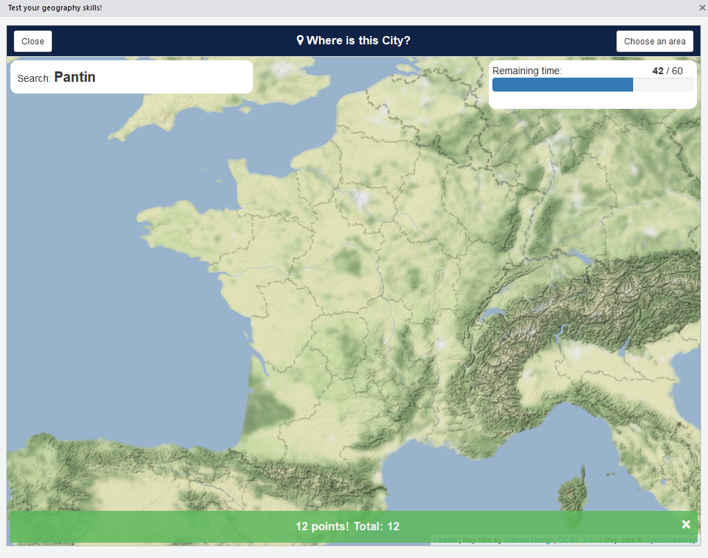

# where

> A city database and a game !

[](https://travis-ci.org/dreamRs/where)


## Installation

Install development version from [GitHub](https://github.com/) with:

``` r
# install.packages("devtools")
devtools::install_github("dreamRs/where")
```


## City database

Get all cities available (109 373) with:

``` r
library(where)
cities <- get_cities()
```


## Test your geography skills!

Choose a country or continent and guess where cities are :

``` r
where::where()
```




