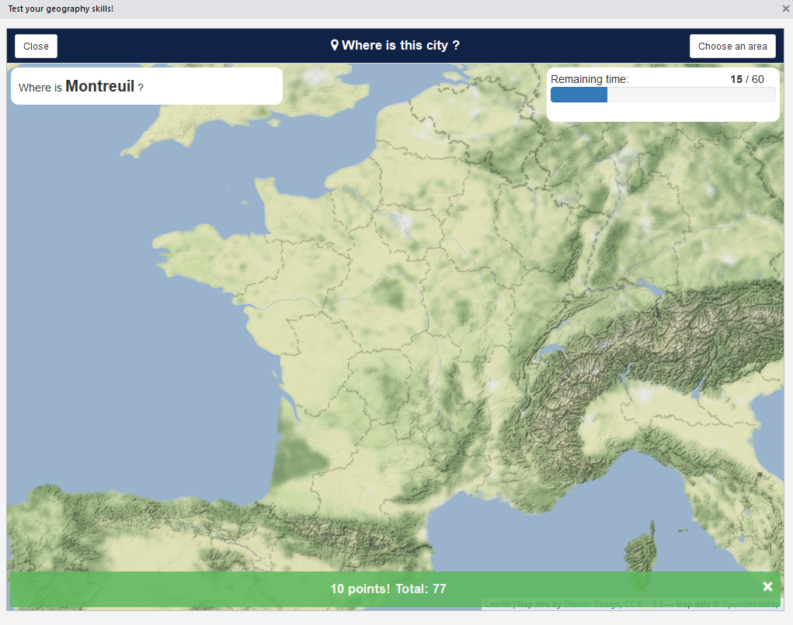

# where 

> A city database and a game !

<!-- badges: start -->
[](https://travis-ci.org/dreamRs/where)
[](https://www.tidyverse.org/lifecycle/#stable)
<!-- badges: end -->


## Installation

Install development version from [GitHub](https://github.com/) with:

``` r
remotes::install_github("dreamRs/where")
```


## Play online

* Country mode : https://dreamrs.shinyapps.io/where-is-this-country/
* City mode : https://dreamrs.shinyapps.io/where-is-this-city/


## City database

Get all available cities (109 373) with:

``` r
library(where)
cities <- get_cities()
```

Data contains all cities with a population > 1000 or seats of adm div (ca 150.000) from [GeoNames](http://www.geonames.org/export/).


Or for a specific country:

```r
uk <- get_cities(country_name = "United Kingdom")
```


Get statistics by country:

```r
get_countries()
```


## Test your geography skills!

### City mode

Choose a country or continent and guess where cities are :

``` r
where::where()
```




### Country mode

You can search country too :

```r
where(mode = "country")
```


### Options

You can launch application in your browser by setting:

```r
options("where.viewer" = "browser")
```

You can use a default area to play with:

```r
options("where.area" = "France")
```


